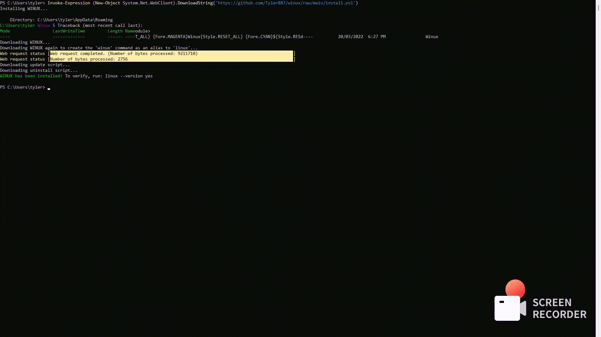

# [](#-winux-linuxexe) Winux (`linux.exe`)

Winux is a Linux® environment for Windows<sup>TM</sup>.
(Well, it's some suckless thing.)

I'm tired of VMs, because they are really slow. I'm also stuck on Windows and can't get those Unix
programs. Well, I got sick of it and made this Linux backwards compatibility frontend for Windows.

[](https://raw.githubusercontent.com/Tyler887/winux/main/18-27-41.gif)

## Requirements

You need **Windows 10** or **Windows 11** to use Winux as WSL only appears in these versions of Windows.

To setup WSL, if you have one of these versions, run `wsl --install --distribution <initial distro name>`.
To see a list of distro names, run `wsl --list --online`.

## Install

An easy way to install Winux is to use PowerShell, which does not require any additional software:

```powershell
Invoke-Expression (New-Object System.Net.WebClient).DownloadString('https://github.com/Tyler887/winux/raw/main/install.ps1')
```

Another way is to use [CPPM](https://github.com/Tyler887/CPPM) or add the [Scoop](https://scoop.sh) bucket:

```batch
powershell -c "Invoke-Expression (New-Object System.Net.WebClient).DownloadString('https://get.scoop.sh')"
scoop install git
scoop bucket add winux https://github.com/Tyler887/winux-scoop.git
scoop install winux/winux
```

You can uninstall Winux as well by opening `uninstall-winux.ps1` or upgrade it by opening `update-winux.ps1`.

If Winux is installed, it can be registered as a `dotnet` command:
```powershell
Invoke-Expression (New-Object System.Net.WebClient).DownloadString('https://github.com/Tyler887/winux/raw/main/dotnetRegister.ps1')
```

### Compile from source
It's easy to compile the source code as a Windows binary, like this (in `powershell`/`pwsh`):

```powershell
python -m pip install pyinstaller # Install pyinstaller from Package Index
python -m pip install colorama questionary # Winux depends on both of these modules
git clone https://github.com/Tyler887/winux.git
Set-Location winux
pyinstaller winux.py --console --onefile #--noupx # Uncomment the --noupx if you don't have UPX
```

### :warning: Misidentification of being a Win32 trojan

Winux might be detected as a virus, called Wactac (`Trojan:Win32/Wactac.B!ml`). If this appears in Windows Security, then uninstall Winux,
and try installing it again. If you still find the same issue, install using Scoop.

## Run without installing

To run Winux without installing it (also called a "live run"), run this in PowerShell:

```powershell
Invoke-Expression (New-Object System.Net.WebClient).DownloadString('https://github.com/Tyler887/winux/raw/main/live.ps1')
```

This downloads and runs the code of Winux using CPython.

Live run should be used to prevent Windows Security from detecting Winux as a virus. CPython (the reference Python implementation) must be installed in order to
preform a live run. (Note that if you do not have Python, `python` will take you to the Python 3.9 download page on MS Store.)

## Python 2 support

[No](https://python.org/doc/sunset-python-2). Over 1k of Python software dropped support for Python 2. Winux is written in Python 3, long since Python 2 was
discontinued. Pull requests adding Python 2 support will be closed and won't be merged.

## RISK WARRANTY
**Use Winux at your own risk. I make no warranty for usage of the frontend. Do not use this program unless you understand the risks of using it.**
